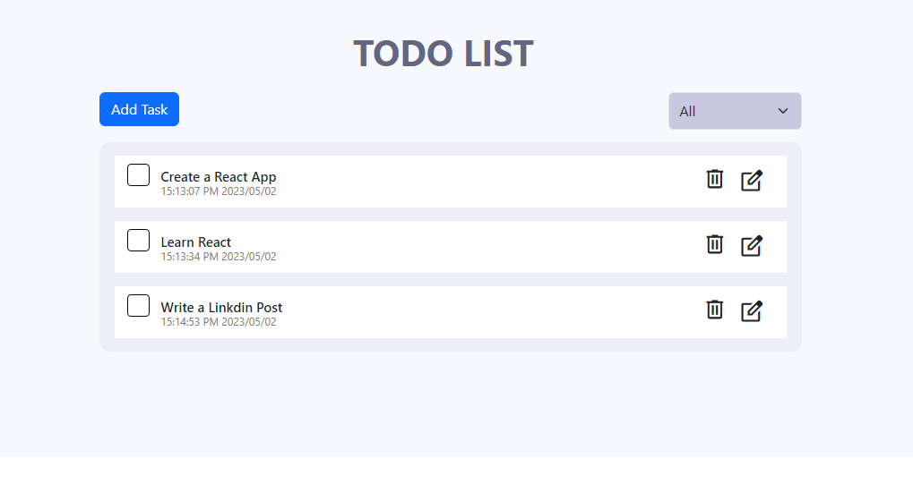

# React Todo App
A complete todo app with all feature.  
Live demo :- https://roaring-queijadas-f7563c.netlify.app/

# Project Description
In this project , I have created a complete todo app with all features. It has all CRUD Operation. I have used React.js Hooks and states . I also added some simple 
animation using Frame Motion. No database is connected all data are store in localstorage . 

# License
<a href="https://choosealicense.com/licenses/mit/">MIT<a>

Happy Coding! 🚀
